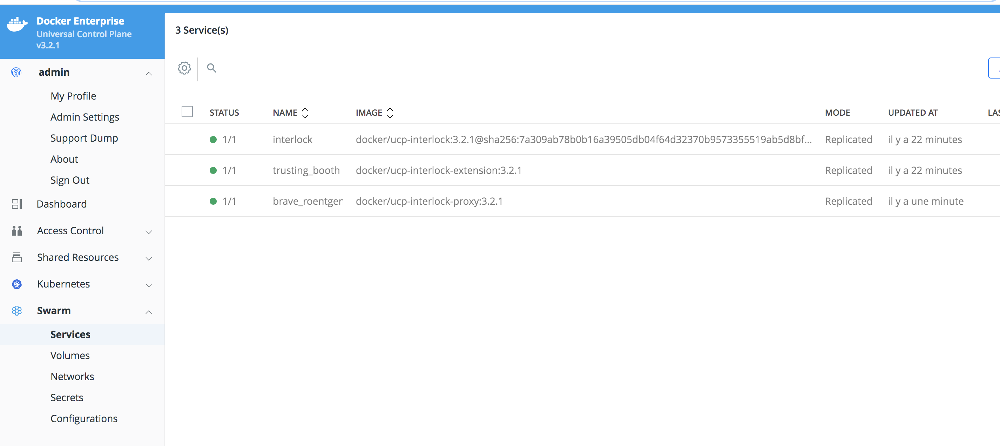
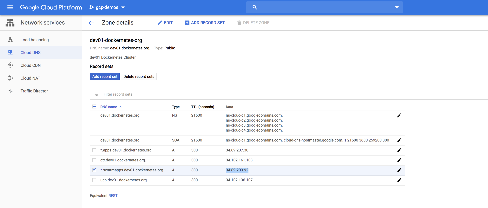

# interlock-routing
L7 Routing with Docker EE and Interlock for  Swarm Based Applications

## Label Interlock proxy nodes

Add a specific label to all Interlock nodes

```
docker node update --label-add role=interlock-infra  interlock-node-0
docker node update --label-add role=interlock-infra  interlock-node-1
```

Apply the same role label for kubectl Commands  
```
kubectl label node  interlock-node-0 role=interlock-infra
kubectl label node  interlock-node-1 role=interlock-infra

```


## Review Interlock Config
Interlock configuration is defined in [service.interlock.conf](./service.interlock.conf)
In this file, pay attention to the following attributes

1. Proxy Constraints
Proxy Constrains define the requirement that should be valid for a node to host a proxy instance
We should include all node with <strong><em>role=interlock-infra</em></strong>

```
    ProxyConstraints = ["node.labels.role==interlock-infra","node.labels.com.docker.ucp.orchestrator.swarm==true"]
```

2. Listen Ports
We want interlock to listen on HostPort 443 and 80

3. Mode ingress/host
Host mode is the recommended approach for high performance production application


## Create the interlock configuration
```
$docker config create interlock.conf ./service.interlock.conf
```

You can inspect the created configuration with the following command
```
$ docker config  inspect  interlock.conf --pretty
```

## Create the interlock Overlay network 
```
$ docker network create -d overlay interlock
```

## Create the Interlock Service
The interlock service create both interlock-extension and interlock-proxy services while starting
```
$ docker service create \
     --name interlock \
     --mount src=/var/run/docker.sock,dst=/var/run/docker.sock,type=bind \
     --network interlock \
     --constraint node.role==manager \
     --config src=interlock.conf,target=/config.toml \
     docker/ucp-interlock:3.2.1 -D run -c /config.toml
t85x3cgjmed8qto4t46ncc052
overall progress: 1 out of 1 tasks
1/1: running   [==================================================>]
verify: Service converged
```

Check The service list
You should have at least these three services
1. interlock
2. interloc-proxy
3. interlock-extension




```
[enono@ucp-node-0 ~]$ docker service ps brave_roentgen
ID                  NAME                   IMAGE                              NODE                DESIRED STATE       CURRENT STATE            ERROR               PORTS
t6j11xoyxvxc        brave_roentgen.1       docker/ucp-interlock-proxy:3.2.1   interlock-node-0    Running             Running 5 minutes ago                        *:443->443/tcp,*:80->80/tcp
l9wxkxhpchxj         \_ brave_roentgen.1   docker/ucp-interlock-proxy:3.2.1   interlock-node-0    Shutdown            Shutdown 5 minutes ago
```

## Create a wildcard certificate
to serve all the applications <em>*.swarmapps.dev01.dockernetes.org</em>,  create a wildcard self signed cert like this

```
openssl req -x509 -nodes -days 365 -newkey rsa:2048 \
-keyout wildcard.key \
-out wildcard.cert \
-subj "/CN=*.swarmapps.dev01.dockernetes.org/O=Dockernetes"
```

## Create Docker Secrets
Then create secrets from cert and key file

```
$ docker secret create wildcardcert ./wildcard.cert
$ docker secret create wildcardkey ./wildcard.key
```


## Deploy the hello stack

```
$ docker stack deploy -c hello-svc-compose.yaml hello
Creating network hello_app_ovl
Creating service hello_app
```

The stack creates an application with two running containers

```
 docker service  ps hello_app
ID                  NAME                IMAGE                                 NODE                DESIRED STATE       CURRENT STATE                ERROR               PORTS
kzg4plbz84ux        hello_app.1         gcr.io/google-samples/hello-app:1.0   interlock-node-0    Running             Running about a minute ago
0z02pksdjejw        hello_app.2         gcr.io/google-samples/hello-app:1.0   worker-node-1       Running             Running about a minute ago
```


## Test the application
```
curl -k  https://hello.swarmapps.dev01.dockernetes.org  --resolve hello.swarmapps.dev01.dockernetes.org:35.246.203.59
Hello, world!
Version: 1.0.0
Hostname: 2f2f03ddddce
```

35.246.203.59 refers to Public IP address of one Interlock Node

When using a loadbalancer, create an A record to resolve *.swarmapps.dev01.dockernetes.org -> ```IngressLoadBalancerIP```




```
curl -k  https://hello.swarmapps.dev01.dockernetes.org
Hello, world!
Version: 1.0.0
Hostname: cb941a7e5c7d
```
